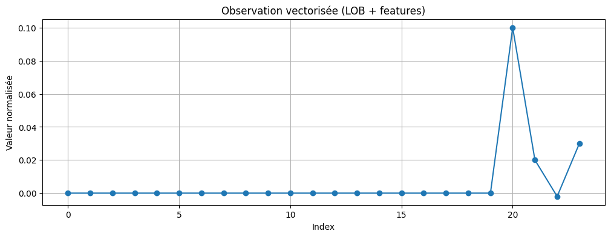

# Latency-Aware LOB Environment

## Objectif
Ce projet implémente un **environnement RL de trading haute fréquence** basé sur un carnet d’ordres (LOB), avec prise en compte de :
- la **latence** (file d’attente des ordres),
- les **coûts d’exécution** et **slippage**,
- un **espace d’observation configurable** (carnet L1–L10, cash, inventory, latence, etc.).

Cet environnement est compatible **Gym / Gymnasium** et constitue la suite du projet `lob_simulator_core`.

---

## Structure du projet
```
latency_aware_lob_env/
│── lob_env/                # Environnement RL
│   ├── env.py               # Classe LatencyAwareLOBEnv
│   ├── latency_queue.py     # Gestion latence (file FIFO)
│   ├── execution_costs.py   # Modèle exécution (slippage + fees)
│   ├── utils.py             # Ordres & types
│   └── __init__.py
│
├── agents/
│   └── random_agent.py      # Agent baseline aléatoire
│
├── tests/                   # Tests Pytest
│   ├── test_env.py
│   └── test_latency.py
│
└── notebooks/
    └── demo_env.ipynb       # Démonstration interactive
```

---

## Fonctionnalités principales
- **Latence simulée** : chaque ordre passe par une file FIFO avant exécution.
- **Exécution réaliste** : fill au mid ± slippage + fees proportionnels au notionnel.
- **Observations enrichies** :
  - Carnet vectorisé (L1–Ldepth),
  - Mid price,
  - Inventory,
  - Cash,
  - Taille de la file de latence.
- **Agent baseline** : `RandomAgent` pour valider le pipeline.

---

## Exemple d’utilisation
```python
from lob_env import LatencyAwareLOBEnv
from agents.random_agent import RandomAgent

# Création d’un FakeLOB (utile si pas encore branché sur le Projet 1)
class FakeLOB:
    def __init__(self, depth=10):
        self.depth = depth
        self.done = False
        self._mid = 100.0
    def reset(self): self.done = False
    def step(self): pass
    def get_state(self): import numpy as np; return np.zeros(2*self.depth)
    def get_mid_price(self): return self._mid

env = LatencyAwareLOBEnv(depth=10, external_lob=FakeLOB(depth=10))
obs = env.reset(seed=42)[0]

agent = RandomAgent(env.action_space)
for t in range(5):
    action = agent.act(obs)
    obs, reward, done, info = env.step(action)[:4]
    print(f"t={t}, action={action}, reward={reward:.5f}, equity={info['equity']:.2f}")
```

---

## Tests
Exécuter les tests unitaires avec :
```bash
pytest -v
```

---

## Démonstration
Notebook : `notebooks/demo_env.ipynb`

Exemple de rendu de l’observation vectorisée :  


---

## Roadmap
- [x] Implémentation environnement RL (latence, coûts, features)
- [x] Random Agent
- [x] Tests Pytest
- [x] Notebook de démo
- [ ] Connexion avec `lob_simulator_core` (Projet 1)
- [ ] Ajout d’indicateurs microstructure (Projet 5)
- [ ] Agents RL (DQN, PPO, SAC) (Projets 3–4)

---

## Installation
```bash
git clone https://github.com/ton-compte/latency_aware_lob_env.git
cd latency_aware_lob_env
pip install -e .
```

---

## Licence
MIT
